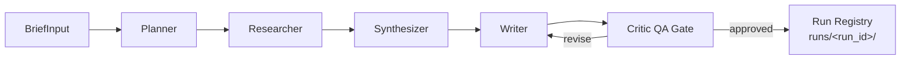

# Briefsmith AI — Production-Style Multi-Agent LLM Workflow

Briefsmith AI is a **production-oriented multi-agent LLM system** that generates marketing briefs from structured product input and lightweight web research. The system is built for reliability and debuggability:

- **LangGraph** orchestrates an explicit agent workflow with a revision loop.
- A **typed `WorkflowState` (Pydantic v2)** makes state transitions and invariants explicit.
- The Writer produces **structured JSON outputs** validated against Pydantic schemas, with automatic **retry on parse/validation failures**.
- A **Critic QA gate** evaluates completeness and citation coverage and can route back to the Writer to converge on an acceptable brief.
- **Local inference via Ollama** (default: `llama3`) and a **free DuckDuckGo HTML research client** with disk caching keep the stack self-contained.
- Every execution is persisted to a **run registry** under `runs/<run_id>/` with atomic artifact writes.

This project uses **Python 3.12**, is **fully tested with pytest**, and relies on **no paid APIs**.

---

## Features

- **Typed, stateful orchestration**
  - LangGraph workflow with clear node boundaries and conditional routing.
  - Pydantic v2 `WorkflowState` for strict validation across steps.

- **Structured LLM outputs (schema-first)**
  - Writer outputs `BriefSections` as JSON with required keys and strict shapes (e.g., structured objections).
  - Retry + validation engine for robust structured generation.

- **Critic-driven revision loop**
  - Critic acts as a QA gate: evaluates validation issues and citation heuristics.
  - Produces revision notes as a checklist for deterministic refinement.

- **Local inference, free research**
  - Ollama-based local LLM inference (default model: `llama3`).
  - DuckDuckGo HTML research client with disk caching for repeatable runs.

- **Run registry with artifact persistence**
  - Each run is assigned a unique `run_id` and persisted to `runs/<run_id>/`.
  - Atomic writes prevent partial artifacts and improve failure recovery.

- **Dual interfaces**
  - Typer CLI for local operation and automation.
  - FastAPI endpoints for programmatic execution and artifact retrieval.

- **Offline, deterministic tests**
  - `pytest` suite with mock LLM/search clients (no network and no Ollama required in tests).

---

## Architecture



### Why LangGraph

LangGraph is used to model the workflow as an explicit state graph with conditional routing. This makes it straightforward to implement:

- deterministic, typed state transitions (`WorkflowState` validation at each node),
- a Critic-controlled revision loop,
- and the ability to attach instrumentation (per-node timings) without changing agent logic.

---

## Workflow Internals (Structured Outputs + QA Gate)

### Structured output pipeline (parse → validate → retry)

The Writer agent is prompted to return **JSON only** for an instance of the target model (not a schema). The system then:

1. extracts the first valid JSON object from the LLM response,
2. validates it against the Pydantic model (e.g., `BriefSections`),
3. retries on failure (parse errors, missing keys, invalid types).

This turns LLM output into a **typed interface** with runtime guarantees, enabling downstream steps (Critic, markdown export, artifact persistence) to remain deterministic.

### QA gate and revision loop

The Critic builds a `BriefOutput`, evaluates it, and decides:

- **approved**: brief is acceptable (may include improvement suggestions),
- **revise**: brief is missing required content or has too many issues.

Critic notes are emitted as a **checklist** (e.g., `Fix 1: ...`) so the Writer gets actionable, testable constraints during revision.

### Validation rules and citation heuristic

Completeness validation returns structured issues:

```json
{ "severity": "hard" | "soft", "message": "..." }
```

- **Hard issues** block approval (e.g., missing required fields, too few sources, too-short market summary).
- **Soft issues** allow approval if limited in number (e.g., minor count shortfalls).

The Critic also counts occurrences of `"(Source #"` in the markdown produced by `to_markdown(output)`. If citations are below the threshold, it is recorded as a **soft issue**.

---

## Run Registry and Artifacts

Each workflow execution is persisted under a unique run directory.

### Run ID format

Run IDs are generated as:

```text
YYYYMMDD_HHMMSS_<short-hex>
```

Example:

```text
20260223_184530_ab12cd
```

### Artifact layout

```text
runs/<run_id>/
  input.json
  sources.json
  findings.json
  brief.json
  final_brief.md
  run_metadata.json
```

- `run_metadata.json` includes: `approval_status`, `revision_count`, `ollama_model`, `search_provider`, `durations_ms`, and optional `notes`.
- All file writes are **atomic** (write temp file then rename) via the run store to avoid partial artifacts.

---

## Requirements

- Python **3.12**
- Ollama installed for local inference (only required for running the workflow, not for tests)

---

## Installation

Create and activate a virtual environment, then install in editable mode:

```bash
python -m venv .venv
source .venv/bin/activate
pip install -e .
```

---

## Ollama Setup

Install Ollama from `https://ollama.com/`, then pull the default model:

```bash
ollama pull llama3
```

To confirm the system can talk to Ollama (plain text + structured output):

```bash
briefsmith llm-check
```

---

## CLI Usage

### Create a sample input

```bash
briefsmith sample-input --path inputs/sample.json
```

### Run the workflow (creates a new run registry entry)

```bash
briefsmith run --input inputs/sample.json
```

Outputs are written under `runs/<run_id>/`. The CLI prints the run directory path, approval status, revision count, and critic notes (even when approved).

### List recent runs

```bash
briefsmith runs --limit 10
```

Optionally specify a custom run base directory:

```bash
briefsmith runs --base-dir runs --limit 5
```

---

## API Usage

Start the API server:

```bash
uvicorn briefsmith.api:app --reload
```

Health check:

```bash
curl http://127.0.0.1:8000/health
```

### POST `/run`

Runs the workflow synchronously, persists artifacts to the run registry, and returns a summary:

```bash
curl -X POST http://127.0.0.1:8000/run \
  -H "Content-Type: application/json" \
  -d '{
    "product_name": "Briefsmith AI",
    "product_description": "A local-first system that generates structured briefs.",
    "target_audience": "Product marketers"
  }'
```

### GET `/runs`

Returns recent run metadata:

```bash
curl "http://127.0.0.1:8000/runs?limit=20"
```

### GET `/runs/{run_id}`

Returns parsed `run_metadata.json`:

```bash
curl http://127.0.0.1:8000/runs/20260223_184530_ab12cd
```

### GET `/runs/{run_id}/artifact/{name}`

Returns an artifact as a file response. `name` must be one of:

- `final_brief.md`
- `sources.json`
- `findings.json`
- `brief.json`
- `input.json`
- `run_metadata.json`

Example:

```bash
curl http://127.0.0.1:8000/runs/20260223_184530_ab12cd/artifact/final_brief.md
```

---

## Testing

Run the full test suite:

```bash
python -m pytest -v
```

Tests use **mock LLM** and **mock search clients** so they run offline with no Ollama dependency and no network calls.

---

## Evaluation

Briefsmith includes an evaluation harness for running repeated executions against the same `BriefInput` and producing aggregate statistics (approval rate, revisions, citation counts, and common validation issues).

Run an evaluation:

```bash
briefsmith eval --input inputs/sample.json --runs 5
```

Offline mode (cache-only research; fails fast on cache miss):

```bash
briefsmith eval --input inputs/sample.json --runs 5 --offline
```

View a report:

```bash
briefsmith eval-view --eval-id <eval_id>
```

Reports are stored under `evals/<eval_id>/` as `eval_report.json` and `eval_report.md`.

---

## Design Decisions

- **Local LLM (Ollama) instead of cloud APIs**
  - Eliminates paid dependencies and vendor coupling.
  - Improves reproducibility and makes offline development practical.

- **Structured outputs instead of freeform generation**
  - Enables schema enforcement, deterministic downstream processing, and retry-on-failure.

- **Critic QA gate with revision loop**
  - Separates generation from verification.
  - Converges on completeness and citation coverage rather than trusting a single pass.

- **Artifact persistence via a run registry**
  - Creates an audit trail for debugging and evaluation.
  - Enables post-hoc analysis and consistent reproducibility of outputs.

---

## Why This Demonstrates Engineering Depth

- **Typed multi-agent orchestration**: explicit LangGraph flow, validated state transitions, and conditional routing.
- **Robust structured-output engineering**: JSON extraction, schema validation, retries, and strict prompt contracts.
- **Quality gating**: Critic-enforced validation (hard vs soft), citation heuristics, and actionable revision checklists.
- **Operational traceability**: run registry with atomic artifact writes and per-node timing metadata.
- **Testability of LLM systems**: deterministic `pytest` suite with mocked LLM and search layers (no network, no paid services).
